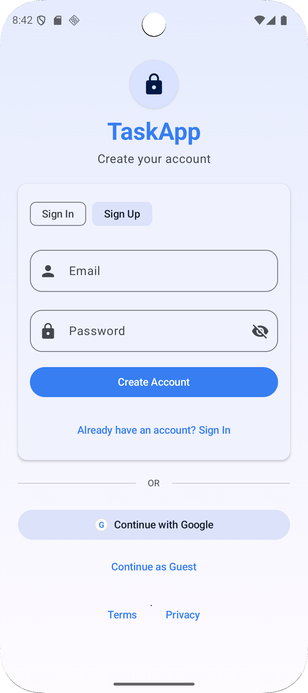
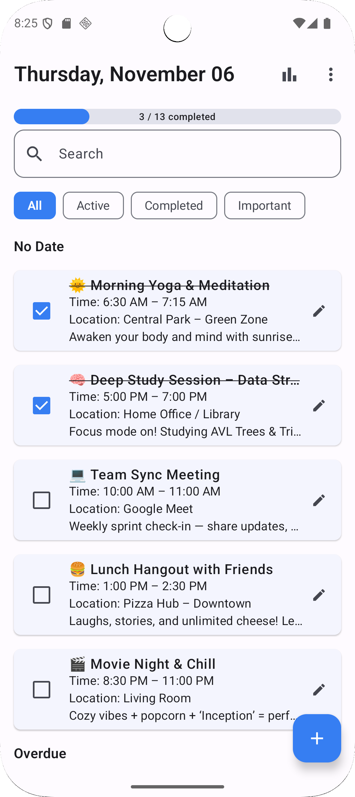
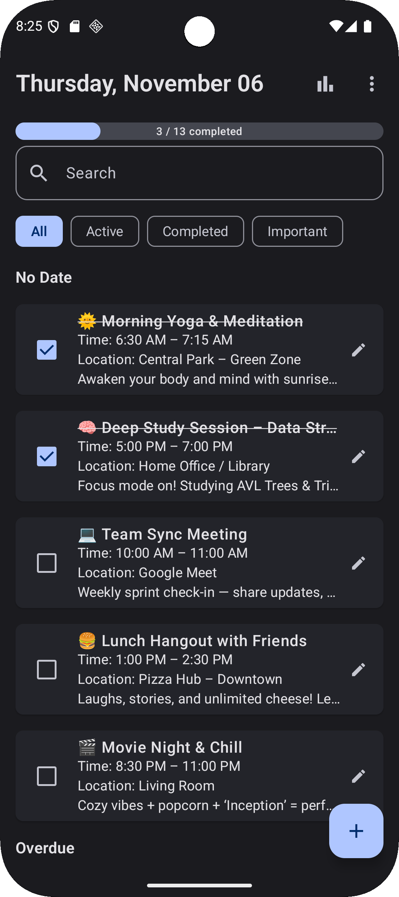
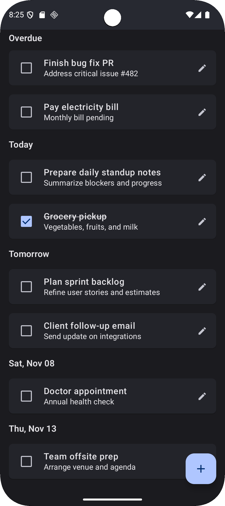
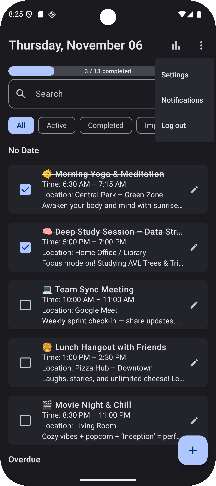
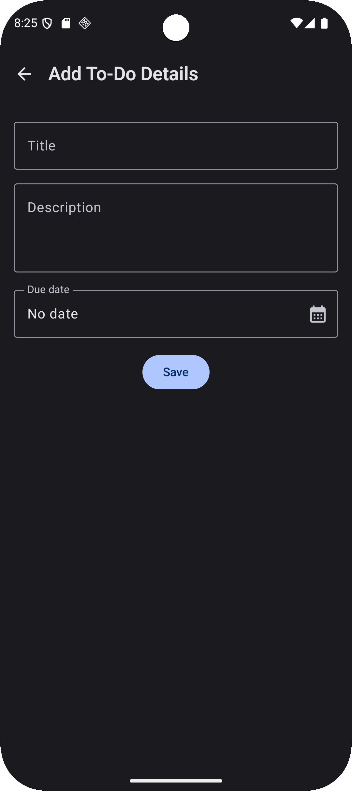
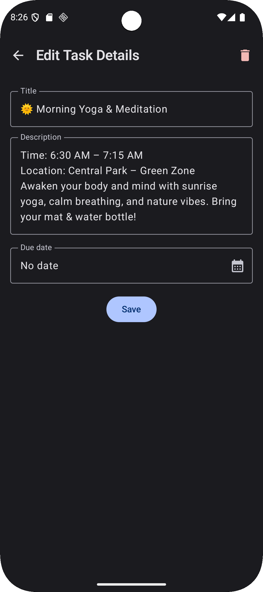
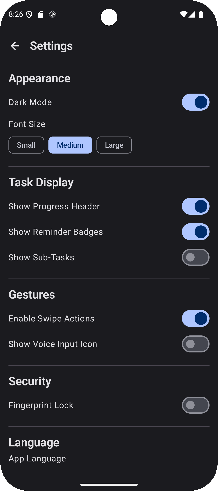
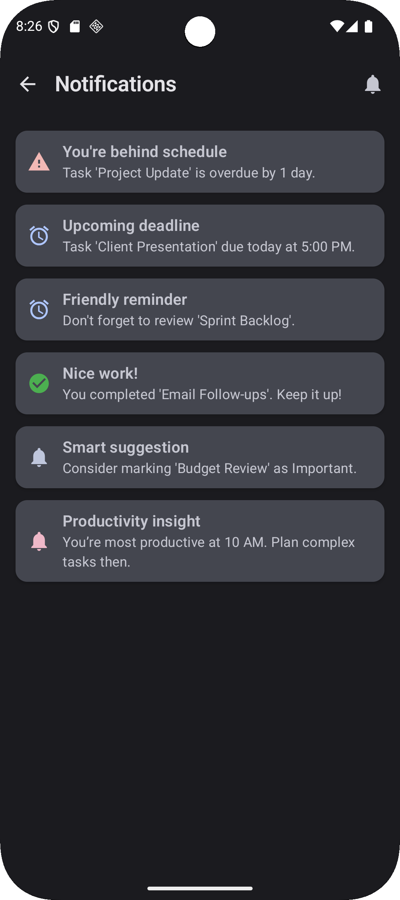
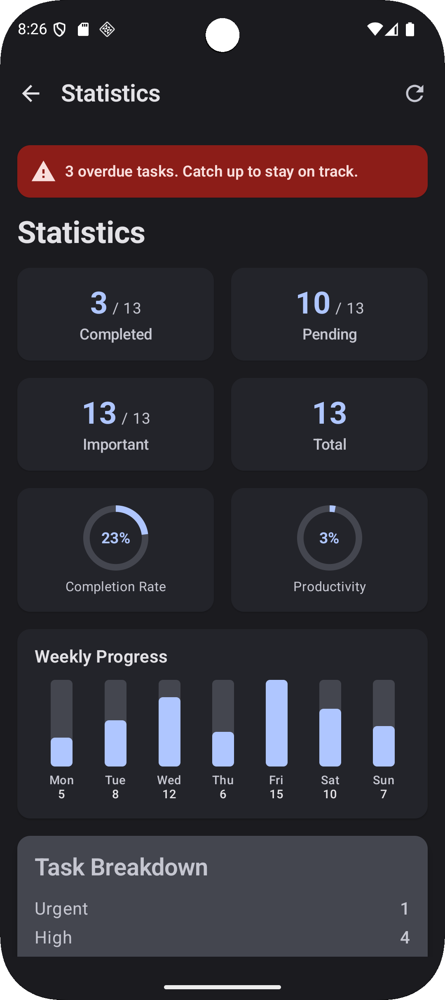

# TaskApp

TaskApp is a modern Android application built with Jetpack Compose that helps you create, organize, and track tasks with priorities, statistics, and insights. It supports email/password, Google, and anonymous sign-in, and includes a clean, themeable UI with light/dark mode.

<div align="center">
  <table>
    <tr>
      <td></td>
      <td></td>
      <td></td>
      <td></td>
    </tr>
    <tr>
      <td></td>
      <td></td>
      <td></td>
      <td></td>
    </tr>
    <tr>
      <td></td>
      <td></td>
      <td></td>
      <td></td>
    </tr>
  </table>
</div>

Note: The grid uses lightweight HTML so it renders consistently on GitHub. Adjust `width` values if you want a tighter or looser look.

## Features
- Task list with creation, editing, selection, and bulk actions
- Priority management and breakdown (Low/Medium/High)
- Statistics overview with completion and productivity indicators
- Recent activity and smart insights
- Sign in/up (email & Google) and guest mode
- Settings: dark mode, UI preferences, font scale, and more
- Profile and notifications screens

## Architecture
This project follows a modular Clean Architecture:

- `app` — Android application module; wires dependencies and composes modules
- `core` — Shared utilities and platform integrations (analytics, billing, etc.)
- `domain` — Business logic, models, and use cases
- `data` — Room, Firebase, networking, repositories, and data sources
- `ui` — Jetpack Compose UI, navigation, view models

Module wiring (see `settings.gradle.kts`):
- `app` depends on `core`, `domain`, `data`, and `ui`
- `ui` depends on `domain`, `core`, and `data`
- `data` depends on `domain` and `core`
- `domain` depends on `core`

### Tech Stack
- Jetpack Compose (Material 3, Navigation)
- Hilt (DI) with KSP
- Room (local persistence)
- Firebase (Auth, Firestore, Analytics, Crashlytics)
- WorkManager (background tasks)
- Coroutines

### Navigation & Flows
Navigation is defined in `ui/src/main/java/com/example/ui/AppRoot.kt` using `NavHost`:
- Routes: `signin`, `home`, `stats`, `profile`, `notifications`, `settings`, `edit`, `edit/{id}`
- Start destination: `signin` when not authenticated, otherwise `home`

Key screens:
- `HomeScreen` — Task list, bulk actions, top-bar menu (settings, notifications, logout)
- `StatsScreen` — Overview cards, weekly progress, priority chips, recent activity, insights
- `SignInScreen` — Email/Password, Google sign-in, anonymous sign-in
- `SettingsScreen` — Dark mode and UI preferences via `LocalDarkModeController` and `LocalUiSettingsController`
- `ProfileScreen` — Account details and sign out via `ProfileViewModel`

## Setup

### Prerequisites
- Android Studio latest (Koala or newer recommended)
- JDK `11`
- Android SDK API 24+

### Steps
1. Clone the repository:
   ```bash
   git clone <repository-url>
   cd TaskApp
   ```
2. Open the project in Android Studio and sync Gradle
3. Configure Firebase (optional but recommended):
   - Place your `google-services.json` into `app/`
   - Ensure Google services plugins are enabled in `app/build.gradle.kts`
4. Configure Google Sign-In server client ID (optional):
   - Add `GOOGLE_SERVER_CLIENT_ID` to `local.properties` or your environment; it is read in `ui/build.gradle.kts`
5. Build and run:
   ```bash
   ./gradlew :app:assembleDebug
   ./gradlew :app:installDebug
   ```

## Build Commands
```bash
# Clean build
./gradlew clean

# Build app
./gradlew :app:assembleDebug
./gradlew :app:assembleRelease

# Install on device/emulator
./gradlew :app:installDebug

# Build UI module (library)
./gradlew :ui:assembleDebug

# Run tests
./gradlew test

# Lint
./gradlew lint
```

## Notes
- The project uses KSP for Hilt and Room to improve build speed.
- Some Compose icon APIs may be deprecated; warnings are expected and non-blocking.

## Folder Structure (Top-Level)
```
TaskApp/
├── app/                # Android app module (entry point)
├── core/               # Core utilities and integrations
├── domain/             # Entities, use cases, business logic
├── data/               # Repositories, Room, Firebase, networking
├── ui/                 # Compose UI and navigation
├── screenshots/        # App screenshots
└── scripts/            # Firebase test utilities and seed scripts
```

## License
This project is provided as-is for demonstration. Add your license notice here if needed.